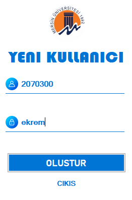
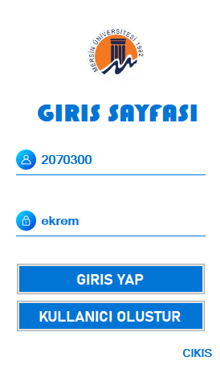
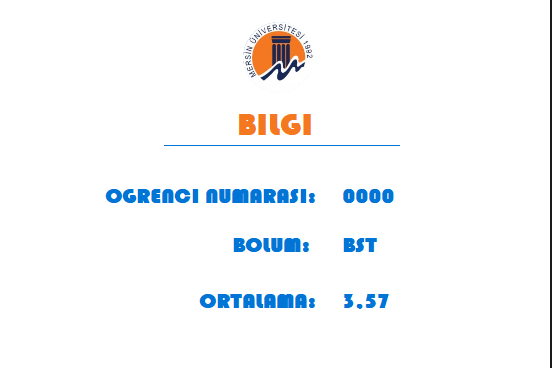

# Login App
(.Net, C#, SqlServer, Database, EntityFrameWork)

### Proje kurulum
1- ilgili dosyalar içerisinde "loginRegister.bak" dosyasý yani veritabaný yedek dosyasý yüklenir.
 
2-

### Kullanýcý Oluþturma Sayfasý
bu sayfada ilgili öðrencinin veya kullanýcýnýn bilgileri girildikten sonra oluþtur butonuna týklandýðýnda veritabanýna yeni veriyi kaydetme iþlemi gerçekleþir.

</img>
 

### kullanýcý giriþ sayfasý
bu sayfada ilgili kiþinin kaydý yapýldýktan sonra sorgu ile textboxtan alýnan veriler veritabanýnda ki ilgili kiþinin numarasý ve þifresi ile karþýlaþtýrýlýr. veriler doðru ise uygulama sistemine giriþ yapar. yanlýþ ise kullanýcýya messagebox gelir
</img>
 

### Uygulama Sayfasý
giriþ yapan kullanýcýlarýn bilgilerini veritabanýndan çeker ve onunla ilgili bilgileri gösterir.
</img>
 

